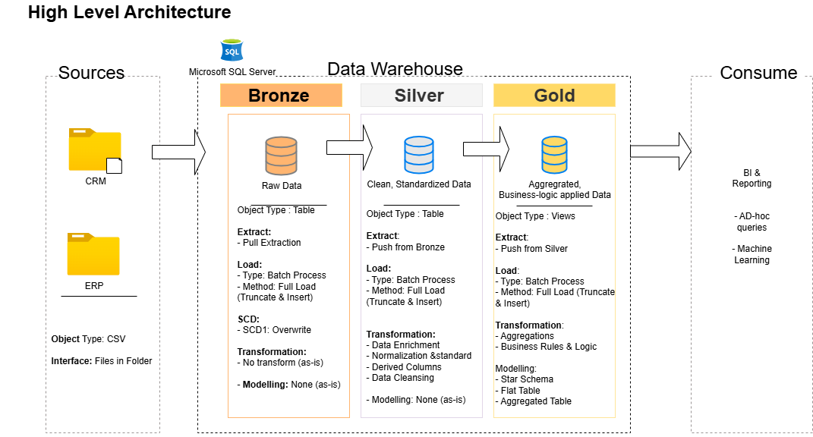

# Data Warehouse and Analytics Project

- Inspired from **Data with Baraa**
- Built a modern DWH with SQL Server
  +) ETL processess
  +) SQL queries insights
  +) PBI reporting

## Data Architecture
- The architecture consist of 3 layers: **Bronze, Silver and Gold**

1. **Bronze Layer**: ingest data as-is from source. Source (CSV) => SQL Server DB 
2. **Silver Layer**: Clean & Standardized & Normalization Processes to prepare for gold layer (no modelling) 
3. **Gold Layer**: Applying business Logic (Data Modelling & Aggregation) for reporting and end-usage
